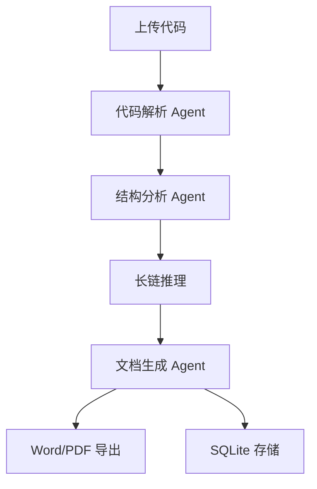

# 🚀 Auto Doc Agent — 智能代码文档生成系统

## 🧠 项目简介

Auto Doc Agent 是一个基于大语言模型的智能代码文档生成系统，能够自动解析 Python 项目代码结构，并生成标准化的软件工程文档（README、接口文档、技术设计文档、测试文档等）。

系统通过多 Agent 协作机制，实现从“代码理解 → 语义分析 → 文档生成 → 格式导出”的全流程自动化，大幅减少开发者在文档编写上的时间成本。

---

## 🎯 核心痛点

- 文档与代码长期不同步
- 手动编写文档效率低
- 毕业设计 / 企业项目文档成本高
- 新人接手项目理解困难

👉 目标：**让代码自动生成文档**

---

## ⚙️ 技术栈

- Python
- LangChain
- Streamlit
- SQLite
- OpenAI API / 本地大模型
- python-docx / reportlab

---

## 🧩 系统架构



---

## 🤖 Agent 工作流

### 1. Code Analyzer
解析代码结构、类、函数、依赖关系

### 2. Semantic Agent
理解业务逻辑与系统架构

### 3. Document Generator
生成：
- README
- API文档
- 技术设计文档
- 测试文档

### 4. Export Agent
导出 Word / PDF，并存储历史记录

---

## ✨ 项目亮点

- 多 Agent 协作架构
- 长链推理增强代码理解
- 自动生成完整软件工程文档
- 支持 Word + PDF 导出
- SQLite 历史记录追踪
- 可扩展本地大模型

---

## 📦 安装运行

```bash
git clone https://github.com/songshuai839/auto-doc-agent.git
cd auto-doc-agent
pip install -r requirements.txt
streamlit run app.py
```

---

## ⚙️ 环境配置

创建 `.env`：

```
OPENAI_API_KEY=your_api_key
OPENAI_MODEL=gpt-4o-mini
```

---

## 🚀 使用方法

1. 上传 Python 项目
2. 选择文档类型
3. 点击生成
4. 下载 Word / PDF

---

## 📁 项目结构

```
auto-doc-agent/
├── app.py
├── agent/
├── exporter/
├── database/
├── uploads/
├── outputs/
└── requirements.txt
```

---

## 📸 效果展示

（可自行添加截图）

---

## 🔥 项目价值

相比传统方式：

- 文档效率提升 80%+
- 自动化程度大幅提升
- 降低维护成本
- 提升团队协作效率

---

## 📈 未来规划

- 支持 Java / C++ 项目
- UML 自动生成
- GitHub 仓库分析
- RAG 知识增强
- 多 Agent 并行优化

---

## ⭐ Star 支持

如果该项目对你有帮助，请点一个 Star ⭐
